# Laporan Hasil Praktikum: Final Project Aplikasi Berbasis Container

## Identitas Mahasiswa

- **Nama:** I Made Andika Nugraha Jayanta Putra
- **NIM:** 2415354092
- **Kelas/Rombel:** 4D TRPL
- **Tanggal Praktikum:** 25 May 2026

---

## Teknologi & Tools yang Digunakan

- **Sistem Operasi:** Windows 11
- **Bahasa Pemrograman / Framework:** Php / Laravel 12
- **Tools Lain:** VS Code, Git, Postman

---

## Dokumentasi

**Dokumentasi/Screenshot:**
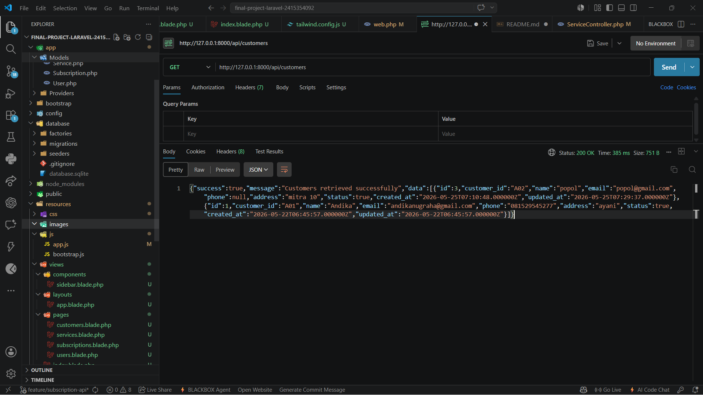
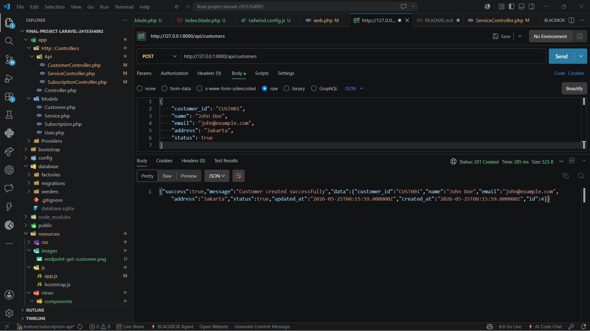
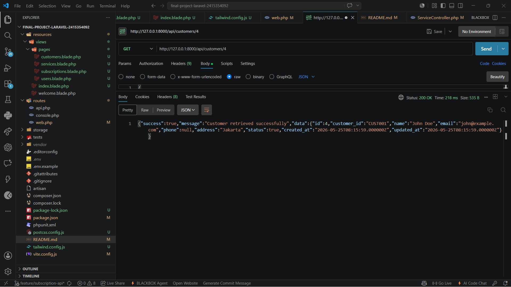
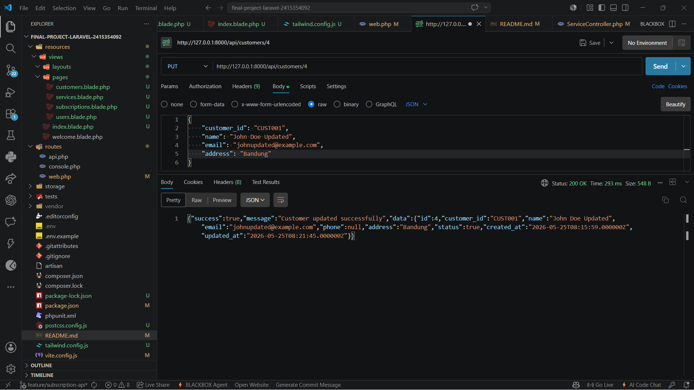
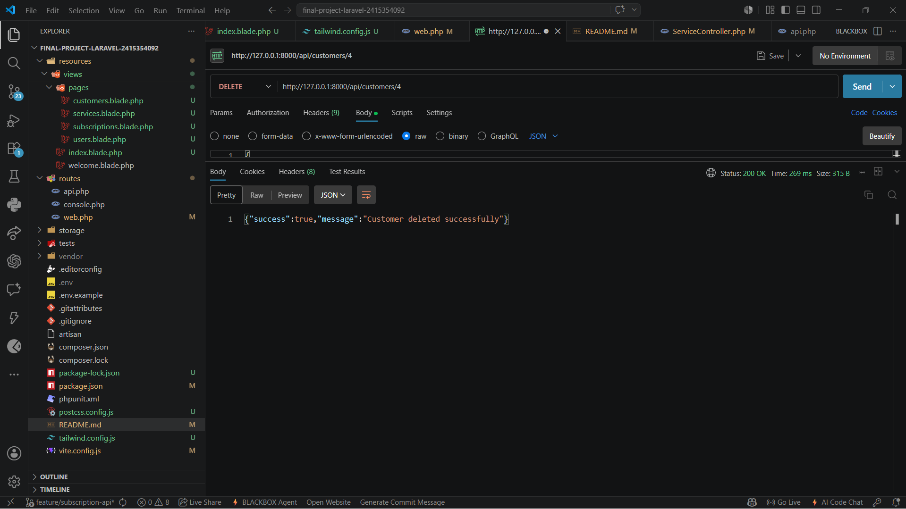
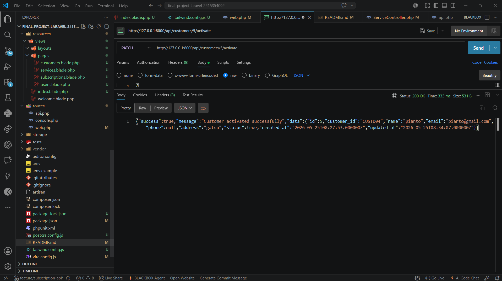
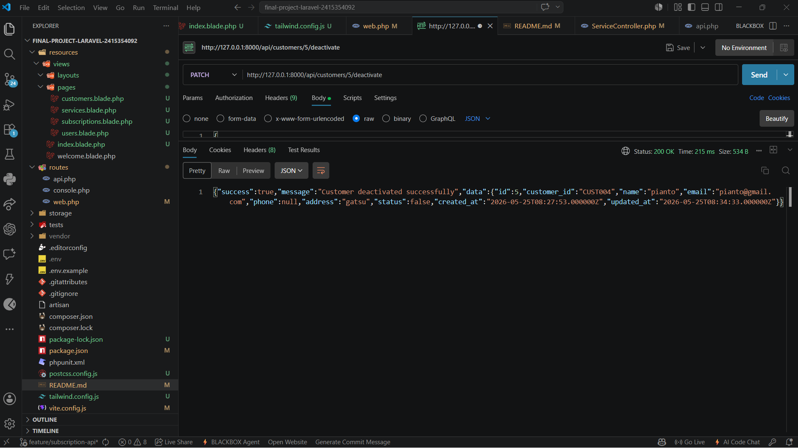

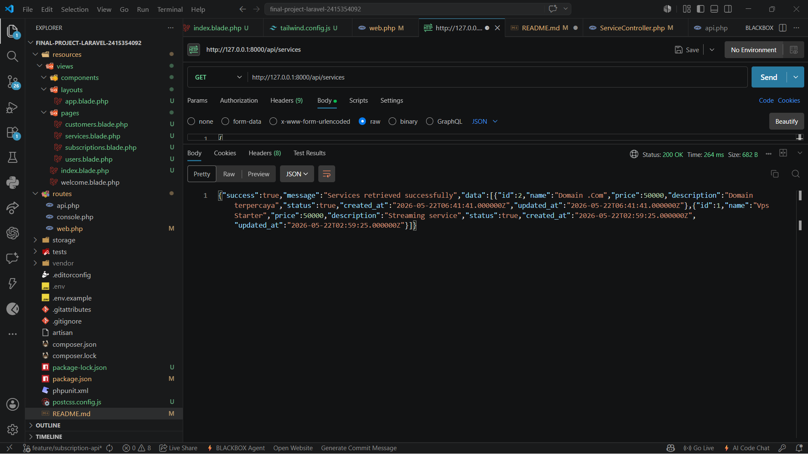

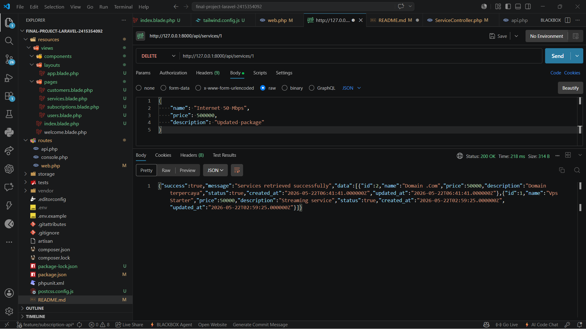

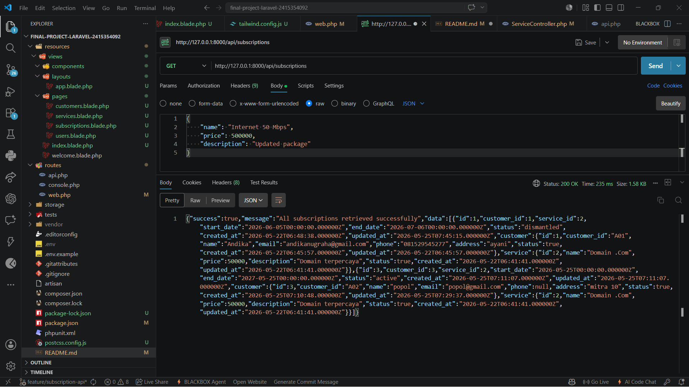
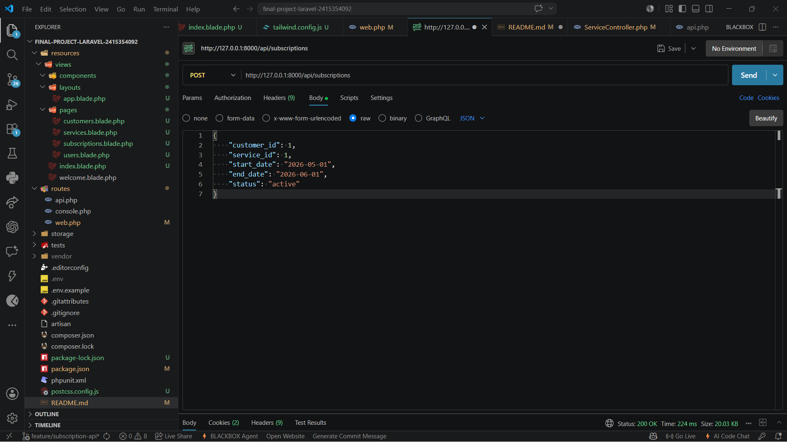
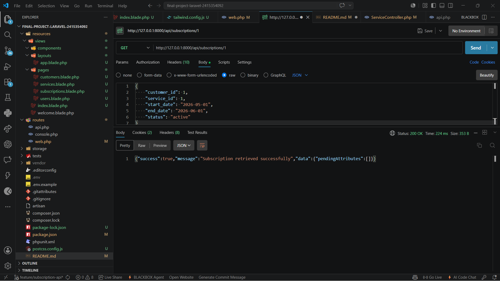

## Kesimpulan

Tuliskan kesimpulan singkat atau kendala yang Anda hadapi beserta solusinya selama melakukan praktikum ini di sini.
